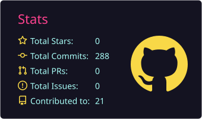
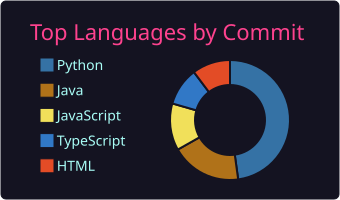

<h1 align="center">Hi 👋, I'm Waliullah</h1>

<h3 align="center">A passionate Full-Stack Developer from Bangladesh 🇧🇩</h3>

  
  

---

## 👨‍💻 About Me

* 🎓 CSE student passionate about software development
* 💻 Mainly focused on **Backend & Full-Stack Development**
* 🌱 Currently learning **JavaScript, React, TypeScript & Next.js**
* 🐍 Experienced with **Python & Django**
* 🧠 Interested in **Data Structures & Algorithms**
* 🗄️ Working with **MySQL & PostgreSQL**
* 🚀 Building real-world projects to improve my development skills
* 📍 Based in **Bangladesh**

 

---

## 🛠️ Languages & Tools

### 💻 Programming Languages

  

### 🌐 Frontend

  

### ⚙️ Backend & Database

  

### 🔧 Tools

  

### 🧠 Core Concepts

  
  
  

---

## 🌱 Currently Learning

  

  <b>JavaScript • TypeScript • React • Next.js</b>

---

## 📊 GitHub Statistics

  
  

---

## 🔥 GitHub Streak

  

---

## 🔗 Connect With Me

### 👨‍💻 Coding Profiles

---

## ⚡ Fun Fact

> Sometimes I feel like an introvert, sometimes an ambivert —
> but when I talk with an extrovert, somehow I become an extrovert too. 😂

---

  

  <b>💻 Code • Learn • Build • Repeat 🚀</b>

